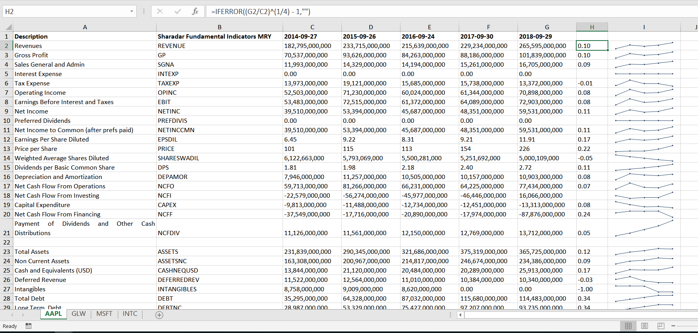
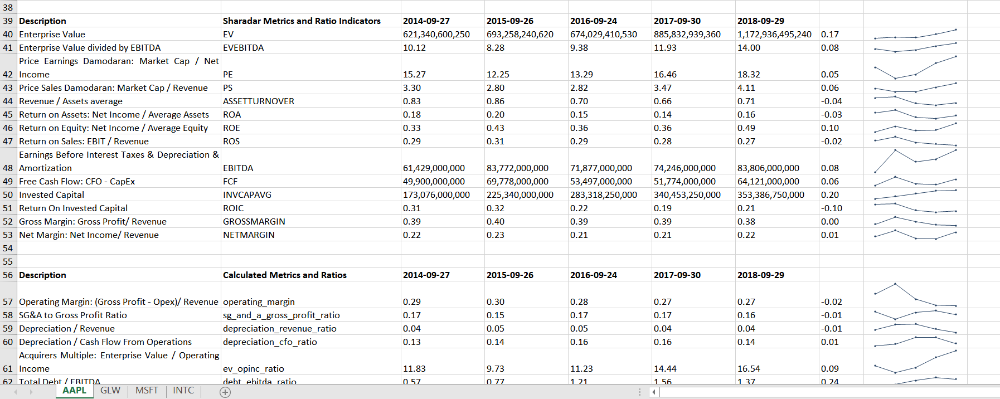

================
quandl_fund_xlsx
================

.. image:: https://img.shields.io/pypi/v/quandl_fund_xlsx.svg
        :target: https://pypi.python.org/pypi/quandl_fund_xlsx

.. image:: https://img.shields.io/travis/robren/quandl_fund_xlsx.svg
        :target: https://travis-ci.org/robren/quandl_fund_xlsx

.. image:: https://readthedocs.org/projects/quandl_fund_xlsx/badge/?version=latest
        :target: https://quandl_fund_xlsx.readthedocs.io/en/latest/?badge=latest
        :alt: Documentation Status

.. image:: https://pyup.io/repos/github/robren/quandl_fund_xlsx/shield.svg
     :target: https://pyup.io/repos/github/robren/quandl_fund_xlsx/
     :alt: Updates

A unofficial CLI tool which uses the Quandl API and the Sharadar Essential Fundamentals
Database to extract financial fundamentals, Sharadar provided ratios as
well as calculate additional ratios. Results are
written to an Excel Workbook with a separate worksheet per ticker analysed.

* Free software: Apache Software License 2.0
* Documentation: https://quandl_fund_xlsx.readthedocs.io.

Features
--------

For a given ticker, fundamental data is obtained using the Quandl API and the
Sharadar Fundamentals database. This data is then used to calculate various
useful, financial ratios. The ratios  include 

- Profitability indicators
- Financial leverage indicators
- Free and Operating Cash flow indicators.

Some REIT specific ratios such as FFO are very roughly approximated.
These specific ratios are only roughly approximated since certain data, namely
Real estate sales data for the period does not appear to be available via the
API (It's often buried in the footnotes of these companies filings).

The output excel worksheet for each ticker processed is divided into three main areas:

- Sharadar statement indicators. This is data obtained from the three main
  financial statements; the Income Statement, the Balance Sheet and the Cash Flow
  Statement. 

- Sharadar Metrics and Ratio Indicators. These are quandl provided financial ratios.

- Calculated Metrics and Ratios. These are calculated by the package from the
  Sharadars data provided and tabulated by the statement indicators and the
  'Metrics and Ratio' indicators.

The python Quandl API provides the ability to return data within python pandas
dataframes. This makes calculating various ratios as simple as dividing two
variables by each other.

The calculations support the data offered by the free sample 
database (formerly referred to by Sharadar as the SF0 database), and the paid for `SF1
<https://www.quandl.com/data/SF1-Core-US-Fundamentals-Data/documentation/dimensions>`_
database. The coverage universe is the same for both the sample data and the
paid database. The key difference being, support as well as a much richer set
of so-called Dimensions (timeperiods). For example the sample data is taken from the annual
filings of companies, whereas the paid data allows for Trailing Twelve Month
as well as quarterly data. 

Note:  For quarterly data, many of the ratios using income and cash flow statement values in the
numerator will be inaccurate when using quarterly data e.g EBITDA/Intereset
expense or Total Debt/ Cash Flow from Operations.

   
   The generated Excel workbook with one sheet per ticker.

   
   Some bespoke metrics and ratios calculated based on Sharadar fundamentals.

Installation
------------

.. code:: bash

    pip install quandl_fund_xlsx

Configuration
-------------

You will need a Quandl API key. This maybe obtained by signing up, for free at `Quandl Signup <https://www.quandl.com/sign-up-modal?defaultModal=showSignUp>`_.
The key will then be available under "profile" when logging into Quandl. This
key allows for access to sample data for many of the datasets.

If you have have a key for the free sample data set the  QUANDL_API_SF0_KEY
environment variable to the value of your key. 

If you have paid for access to the Sharadar 
fundamentals data set, then set the QUANDL_API_SF1_KEY in the environment.

.. code:: bash

   export QUANDL_API_SF0_KEY='YourQuandlAPIKey'
   
   or

   export QUANDL_API_SF1_KEY='YourQuandlAPIKey'

For windows the setx command is used to set environment variables..

Usage of the quandl_fund_xlsx CLI command
-----------------------------------------
.. code:: bash

	quandl_fund_xlsx -h
	quandl_fund_xlsx

	Usage:
	quandl_fund_xlsx (-i <ticker-file> | -t <ticker>) [-o <output-file>]
									[-y <years>] [-d <sharadar-db>]
                                    [--dimension <dimension>]

	quandl_fund_xlsx.py (-h | --help)
	quandl_fund_xlsx.py --version

	Options:
	-h --help             Show this screen.
	-i --input <file>     File containing one ticker per line
	-t --ticker <ticker>  Ticker symbol
	-o --output <file>    Output file [default: stocks.xlsx]
	-y --years <years>    How many years of results (max 7 with SF0) [default: 5]
	-d --database <database>    Sharadar Fundamentals database to use, SFO or
								SF1 [default: SF0]
        --dimension <dimension>     Sharadar database dimension, ARY, MRY, ART, MRT [default: MRY]
	--version             Show version.

.. code:: bash

	quandl_fund_xlsx -t INTC -o intc-MRY.xlsx
	{'--database': 'SF0',
	'--input': None,
	'--output': 'INTC-MRY.xlsx',
	'--ticker': 'INTC',
	'--years': '5'}
	('Ticker =', 'INTC')
	2017-08-22 06:08:59,751 INFO     Processing the stock INTC
	2017-08-22 06:09:06,012 INFO     Processed the stock INTC

	ls -lh excel_files
	total 12K
	-rw-rw-r-- 1 test test 8.7K Aug 22 06:09 intc-MRY.xlsx

Local Development
-----------------

This section is only of relevance if you wish to hack on the code yourself,
perhaps to add new ratios or display other Sharadar provided data values.

It's recommended to setup a virtual environment and perform the installation
within this. Use  pip to install the requirements but not the
package.

.. code:: bash

    pip install -r requirements_dev.txt

    # Run the CLI by running as a module
    python -m quandl_fund_xlsx.cli -t MSFT

    # Run the tests
    pytest

If you wish to install the package locally within either a virtualenv or
globally this can be done once again using pip.

.. code:: bash

    pip install -e .

    # Now the CLI is installed within our environment and should be on the
    # path
    quandl_fund_xlsx -t MSFT

How to get help contribute or provide feedback
----------------------------------------------

See the `contribution submission and feedback guidelines <ref-contributing>`

Credits
---------

This package was created with Cookiecutter_ and the `audreyr/cookiecutter-pypackage`_ project template.

.. _Cookiecutter: https://github.com/audreyr/cookiecutter
.. _`audreyr/cookiecutter-pypackage`: https://github.com/audreyr/cookiecutter-pypackage

